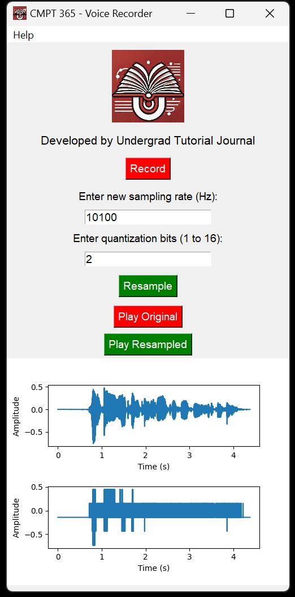

# CMPT 365 Audio Demo



This app is developed by **Undergrad Tutorial Journal** as a sample demo for **CMPT 365 Multimedia Systems** course to demonstrate audio digitization.


## How to Use

1. **Install dependencies**: Use the provided `requirements.txt` to install all necessary packages.
    ```sh
    pip install -r requirements.txt
    ```

2. **Run the application**: Execute the main script to start the demo.
    ```sh
    python main.py
    ```

3. **Record audio**: Click the Record button to start recording audio.

4. **Resample audio**: Enter a new sampling rate and quantization bits to resample the recorded audio.

5. **Play audio**: Use the Play Original and Play Resampled buttons to play the original and resampled audio.

## License

This project is licensed under the [MIT License](https://opensource.org/license/mit).